# Servidor WordPress

Infraestrutura para hospedar um servidor wordpress em uma instância EC2 e armazenar os dados produzidos em um RDS.

## Arquitetura

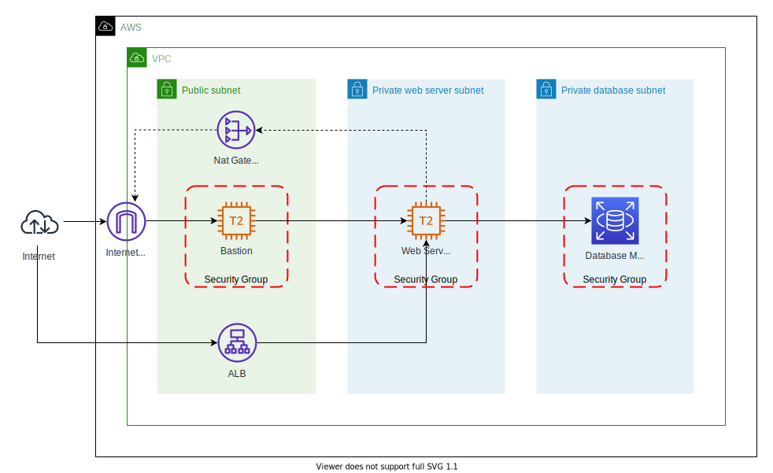

Componentes:

### VPC

Rede privada envolvendo os componentes

### Public subnet

Sub-rede com componentes que possibilitam o acesso externo aos componentes existentes:

- ALB: Application Load Balancer para redirecionar as requisições recebidas em seu DNS público para o servidor web existente na subnet privada.
- Internet Gateway: Habilita acesso a internet aos recursos da VPC.
- Nat Gateway: Permite que componentes em subnets privadas tenham acesso a internet, estes componentes não são acessíveis na internet, apenas possuem acesso a ela.
- Security group: SSH liberado publicamente para acesso ao bastion.
- EC2: Instância t2.micro, esta instância é utilizada apenas para acessar outras instâncias privadas de modo seguro, por isso é chamada de [bastion](https://aws.amazon.com/pt/quickstart/architecture/linux-bastion/).

### Private web server subnet

Sub-rede para o servidor web (EC2):

- Security group:
  - HTTP liberado publicamente;
  - SSH liberado na VPC (10.0.0.0/22).
- EC2: Servidor web com acesso ao banco de dados RDS, a única forma de acesso ao bash é via bastion, não é possível acessá-lo diretamente via internet, apenas via HTTP. Para baixar pacotes como o client do MySQL e PHP é utilizado o Nat Gateway mencionado anteriorment, a instância EC2 é direcionada para o Nat Gateway que por sua vez encaminha a requisição para o Internet Gateway possibilitando o acesso a internet pela instância.

### Private database subnet

Sub-rede para o banco de dados MySQL (RDS)

- Security Group: Acesso liberado a subnet privada (servidor web).
- RDS: MySQL para salvar dados gerados pelo servidor wordpress.

## Preparação para implantação

A infraestrutura criada precisa das seguintes variáveis para funcionar corretamente:

| Nome                     | Descricao                                                       | Padrão        |
| ------------------------ | --------------------------------------------------------------- | ------------- |
| wordpress_database       | Nome do banco de dados que será criado                          | wordpress     |
| bastion_key_name         | Key pair para acesso ao bastion (chave .pem)                    | wordpress-lab |
| web_server_key_name      | Key pair para acesso ao web server (chave .pem)                 | wordpress-lab |
| wordpress_user           | Nome do usuário que possuirá acesso a base `wordpress_database` |               |
| wordpress_user_password  | Senha do `wordpress_user`                                       |               |
| master_rds_user          | Nome do usuário master (root)                                   |               |
| master_rds_user_password | Senha do usuário master                                         |               |

**Importante**: A [documentação](https://registry.terraform.io/providers/hashicorp/tls/latest/docs/resources/private_key) do terraform orienta que a criação da [Key Pair](https://docs.aws.amazon.com/pt_br/AWSEC2/latest/UserGuide/ec2-key-pairs.html) seja feita via console ou fora dos arquivos terraform para não serem armazenados nos arquivos de estado. O direcionamento é que apenas o nome da Key Pair seja utilizado nos arquivos ".tf".
Caso a chave `wordpress-lab` não exista região em que o ambiente será publicado (us-east-1) a infra não será criada. As Keys Pairs podem ser substituidas atribuido as variáveis `bastion_key_name` e `web_server_key_name` novos valores, este processo será detalhado abaixo.

### Variáveis de ambiente

Para criar variáveis que serão identificadas pelo terraform o prefixo **TF_VAR\_** precisa ser utilizado.

#### Powershell

Criar variáveis no powershell:

```powershell
$env:TF_VAR_wordpress_database = 'exemplo'
$env:TF_VAR_wordpress_user = 'usuario wordpress'
$env:TF_VAR_wordpress_user_password = 'senha super secreta'
$env:TF_VAR_master_rds_user = 'usuario root'
$env:TF_VAR_master_rds_user_password = 'outra senha super secreta'
$env:TF_VAR_bastion_key_name = 'bastion-key-pair'
$env:TF_VAR_web_server_key_name = 'web-server-key-pair'
```

#### Shell

Criar variáveis no shell:

```sh
export TF_VAR_wordpress_database = 'exemplo'
export TF_VAR_wordpress_user = 'usuario wordpress'
export TF_VAR_wordpress_user_password= 'senha super secreta'
export TF_VAR_master_rds_user = 'usuario root'
export TF_VAR_master_rds_user_password = 'outra senha super secreta'
export TF_VAR_bastion_key_name = 'bastion-key-pair'
export TF_VAR_web_server_key_name = 'web-server-key-pair'
```

**Observação**: Criando as as variáveis `TF_VAR_bastion_key_name` e `TF_VAR_web_server_key_name` com os valores acima o padrão "wordpress-lab" definido nas variáveis bastion_key_name e web_server_key_name serão substituidos por **bastion-key-pair** e **web-server-key-pair**, respectivamente.

#### Variáveis obrigatórias para execução

Se as variáveis citadas nas seções anterioes não forem criadas ao implantar a infra elas serão solicitadas conforme imagem abaixo:

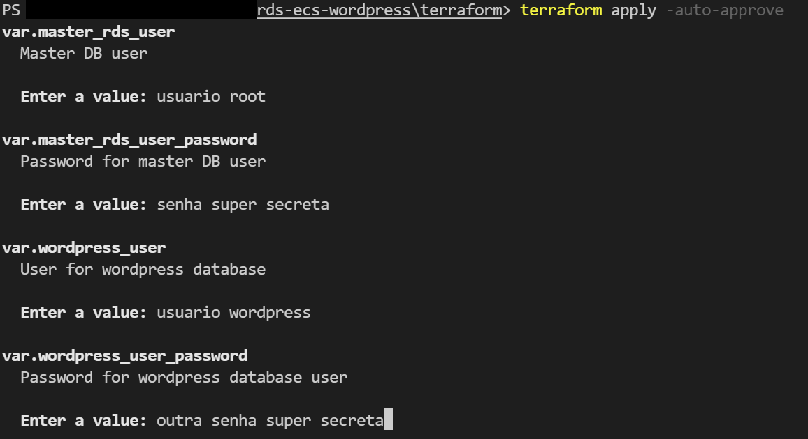

### Implantação

A infraestrutura é provisionada a partir dos comandos a seguir:

- terraform init: Baixa os modulos e providers necessários para execução;
- terraform plan: Exibe plano de execução para criação, atualização e/ou remoção de recursos;
- terraform apply: Executa plano e altera os recursos conforme exibido no plan.

Os comandos `terraform init` e `terraform appy` são obrigatórios para criação da infraestrutura via [terraform cli](https://learn.hashicorp.com/tutorials/terraform/install-cli?in=terraform/aws-get-started).

Executando o comando `terraform apply -auto-approve` a validação é automaticamente aprovada.

### Configuração pós implantação

Os valores entre colchetes utilizados nesta seção deverão ser substituidos em testes locais.

Quando a execução finalizar 4 outputs serão exibidos conforme tabela e imagem abaixo:

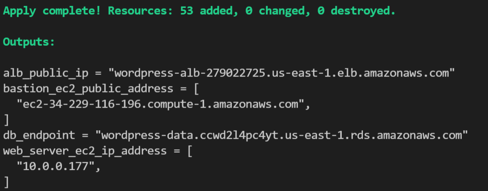

| Output                     | Descrição                                   |
| -------------------------- | ------------------------------------------- |
| bastion_ec2_public_address | DNS público para conexão com Bastion        |
| alb_public_dns              | Endereço do application load balancer       |
| db_endpoint                | Endpoint de conexão com o banco de dados    |
| web_server_ec2_ip_address  | Endereço ipv4 para conexão com servidor web |

**Observação**: Não é interessante a exposição desses valores em ambientes produtivos, a variável `sensitive = true` pode ser adicionada ao [output](https://www.terraform.io/docs/language/values/outputs.html#sensitive-suppressing-values-in-cli-output) para ocultá-los.

O primeiro passo a ser executado após o provisionamento da infra é o acesso ao ALB, ele redirecionará a requisição para a url http://[alb_public_dns]/wp-admin/setup-config.php onde o wordpress pode ser configurado clicando em `Let's go!` conforme imagens abaixo.

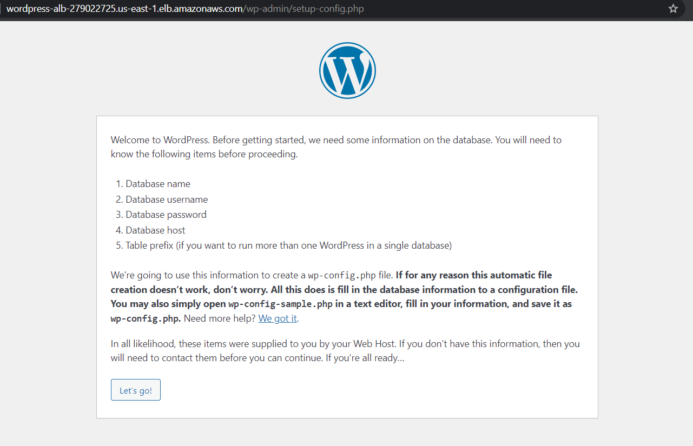

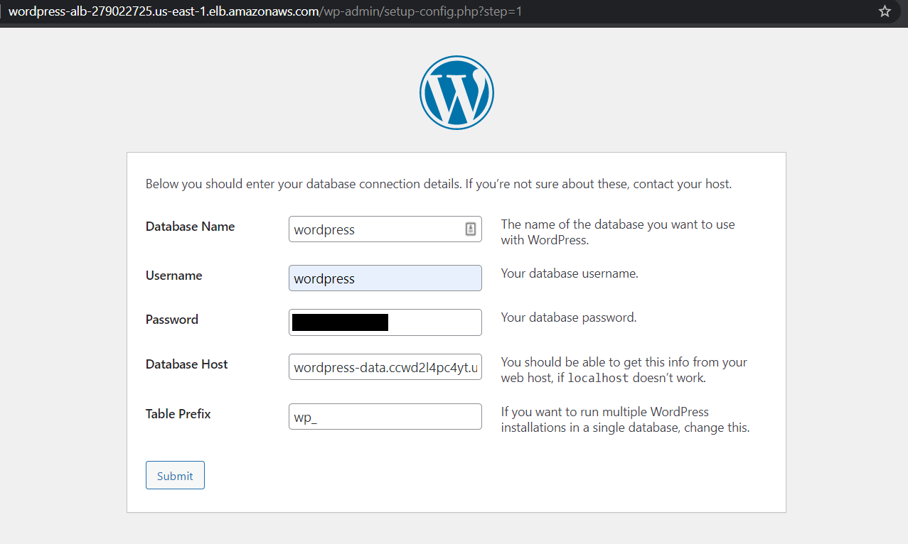

Com a configuração feita corretamente a seguinte tela será exibida, solicitando que o conteúdo seja adicionado ao arquivo `wp-config.php`.

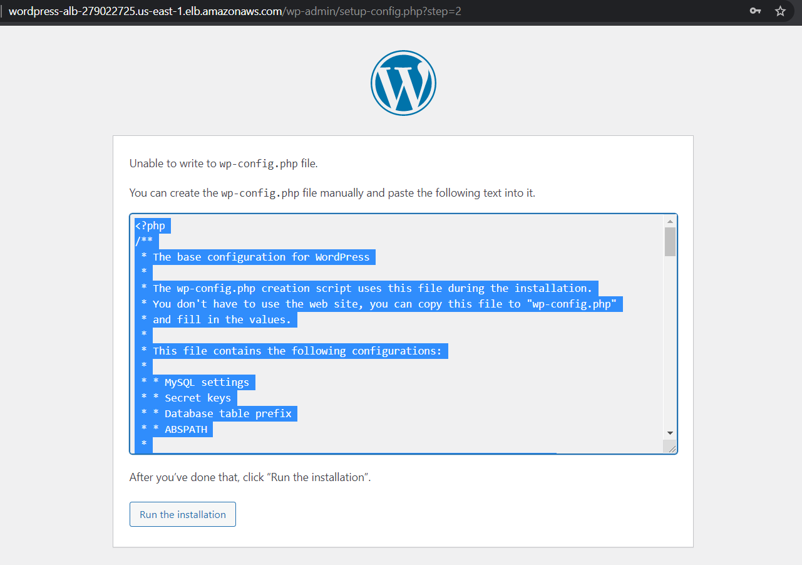

Para adicionar este conteúdo no arquivo `wp-config.php` o web server precisa ser acessado, conforme mencionado anteriormente a instância web só pode ser acessada por recursos em sua VPC, então o acesso será feito a partir do bastion.

Sem a chave privada de acesso a web server o bastion também não possui acesso ao servidor, então sua chave privada (.pem) deve ser copiada com o comando SCP.

```sh
scp -i [bastion_key_name].pem [web_server_key_name].pem ec2-user@[DNS bastion]:/home/ec2-user
```

Em casos de erro ao executar o SCP ou SSH as [permissões](https://docs.aws.amazon.com/pt_br/AWSEC2/latest/UserGuide/TroubleshootingInstancesConnecting.html#troubleshoot-unprotected-key) da chave .pem devem ser revisadas e alteradas preferencialmente, a [AWS](https://docs.aws.amazon.com/pt_br/AWSEC2/latest/UserGuide/ec2-key-pairs.html) exige a permissão 400, ela pode ser alterada com o comando chmod.

```sh
chmod 400 [web_server_key_name].pem
```

A instância bastion pode ser acessada utilizando SSH com a chave [bastion_key_name].pem criada no inicio do processo.

```sh
ssh -i [bastion_key_name].pem ec2-user@[bastion_ec2_public_address]
```

Conectado ao bastion o web server precisa ser acessado para que o arquivo `wp-config.php` seja criado.

```sh
ssh -i [bastion_key_name].pem ec2-user@[web_server_ec2_ip_address]
```

**Importante**: A permissão precisa ser alterada para 400 conforme mencionado anteriormente, caso contrário o bastion não conseguirá acessar o web server.

O arquivo `wp-config.php` pode ser criado com o comando vim.

```sh
sudo vim /var/www/html/wp-config.php
```

Com o arquivo criado seu conteúdo deve ser adicionado, porém aperte `i` antes de colar para que o editor vim entre em modo de inserção. Para salvar o conteúdo adicionado a opção `:x` pode ser utilizada.

Com o arquivo `wp-config.php` criado e salvo corretamente ao acessar o endereço do ALB novamente a página de configuração do administrador do site será exibida.

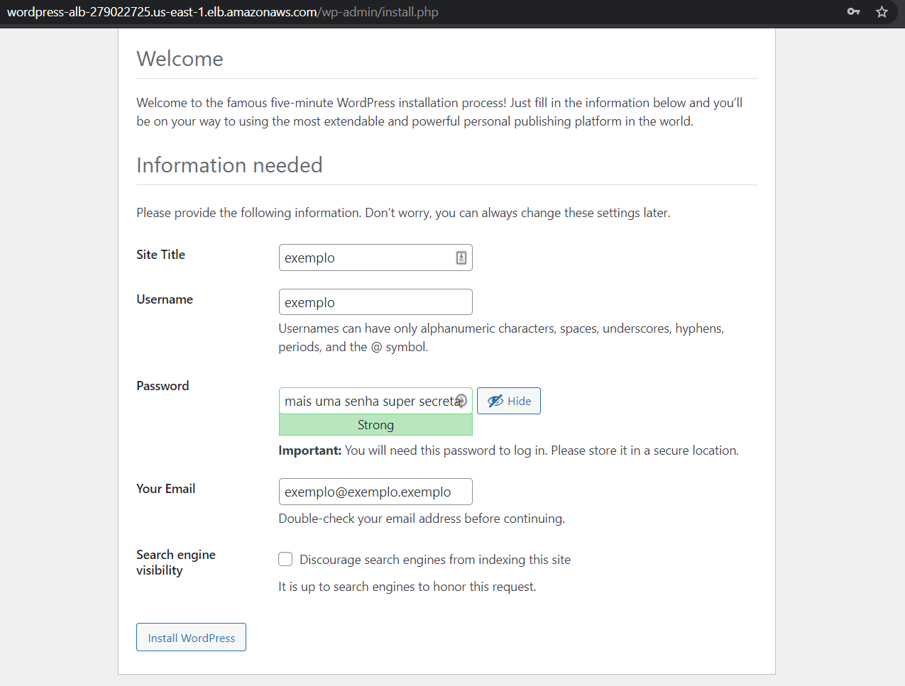

Com os campos preenchidos a configuração o wordpress pode ser finalizada, este processo cria as tabelas no RDS para que as alterações feitas sejam armazenadas.

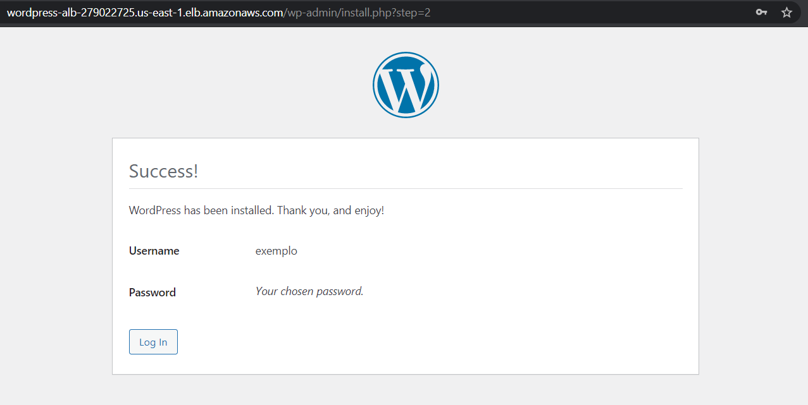

Feita a configuração e as tabelas criadas o site já pode ser acessado com o administrador conforme imagens abaixo.

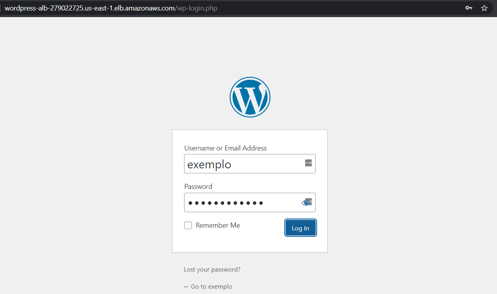

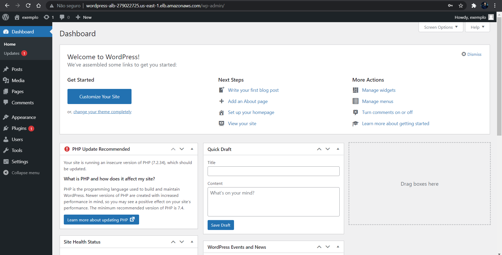

Para validar que as tabelas foram criadas o banco pode ser acessado com o comando `mysql`.

```
mysql -u [master_rds_user] -h [db_endpoint] -p[master_rds_user_password]
```

A imagem abaixo exibe as tabelas do banco de dados `wordpress` a partir dos comandos `show databases;`, ` use wordpress;` e `show tables;`.

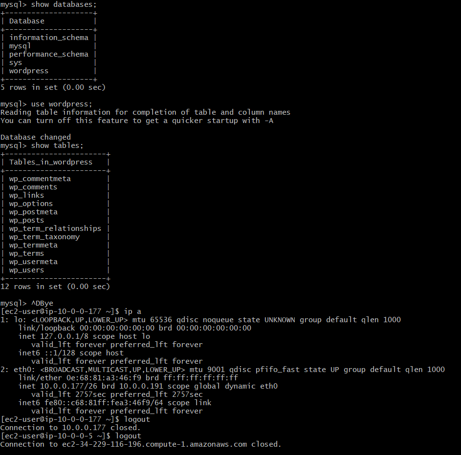

É possível visualizar que o web server (10.0.0.177) foi acessado na saída do comando `ip a`.

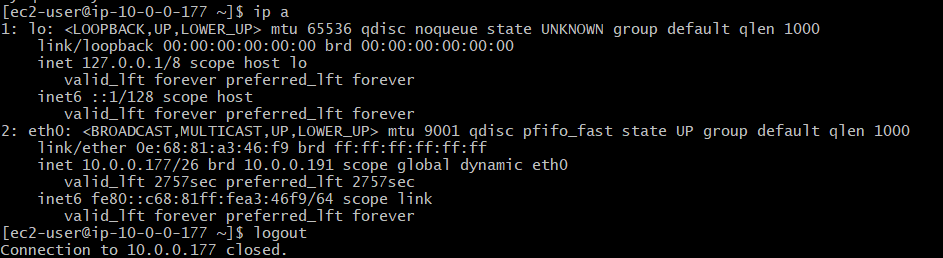

O acesso ao bastion também é evidenciado devido a mensagem "Connection to ec2-34-229-116-196.compute-1.amazonaws.com closed.".

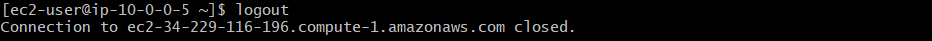

### Desalocando recursos

O comando `terraform destroy -auto-approve` pode ser executado para remover todos os recursos criados via arquivos terraform. A opção `-auto-approve` não é obrigatória, se ela não for adicionada ao comando destroy será solicitada aprovação, quando o comando finalizar a mensagem "Destroy complete! Resources: X destroyed." será exibida, onde X é o número de recursos criados pelo `terraform apply`.

### Curiosidades

O ambiente web é provisionado via shell script, no arquivo [wordpress.sh](terraform/scripts/wordpress.sh) todos os passos para instalação do wordpress e suas dependências, apache web server, php7, mysql client estão declarados.
A propriedade `user_data` do [web-server.tf](terraform/web-server.tf) foi utilizada para executar o script na inicialização da instância, então sempre que uma nova instância for criada as configurações iniciais do wordpress estarão preparadas.

Analisando o arquivo `cloud-init-output.log` é possível listar os logs da execução de scripts adicionados ao `user_data` para troubleshooting.

```sh
sudo cat /var/log/cloud-init-output.log
```

É importante frisar que este é um estudo de caso, em um ambiente produtivo onde o provisionamento de outras máquinas é utilizado com auto scaling o ideal seria criar uma AMI com o ambiente configurado lendo as configurações do wordpress de variáveis de ambiente.
```
